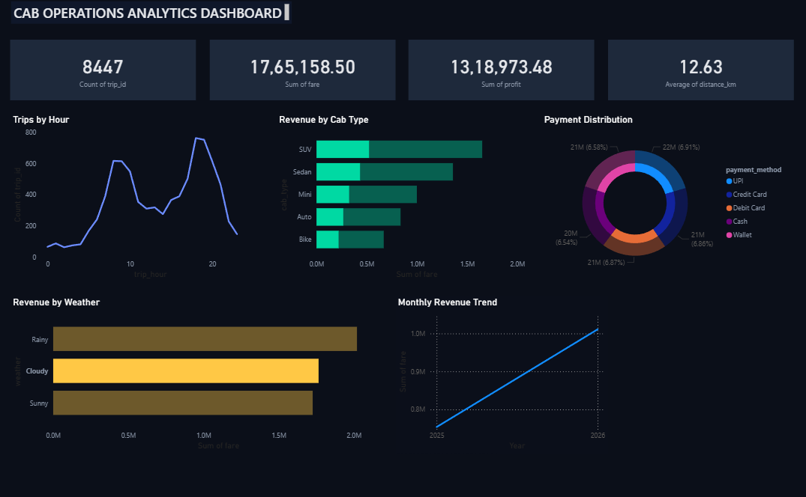

# 🚕 Cab Operations Analytics Dashboard

A data analytics project that simulates and analyzes cab operations in Hyderabad using Python, SQL, and Power BI. The project generates 25,000 synthetic cab trips and provides business insights through an interactive dashboard.

---

## 📖 Project Overview

The Cab Operations Analytics Dashboard is designed to analyze revenue, demand patterns, weather impact, and customer behavior in a cab booking system.

Using Python, a synthetic dataset of 25,000 cab trips was generated. The data was then analyzed using SQL queries and visualized in Power BI to derive meaningful business insights.

---

## 🎯 Objectives

- Analyze cab revenue patterns.
- Identify peak demand hours.
- Compare revenue across different cab types.
- Study the impact of weather on revenue.
- Analyze payment preferences.
- Compare weekday and weekend performance.

---

## 🛠️ Tech Stack

- Python
- Pandas
- Faker
- Geopy
- SQL
- Power BI
- VS Code

---

## 📂 Project Structure

```text
cab-operations-analytics-dashboard/

├── data/
│   ├── trips.csv
│   └── hyderabad_locations.csv
│
├── python/
│   ├── data_generator.py
│   ├── analysis.py
│   └── distance_calculator.py
│
├── sql/
│   ├── schema.sql
│   └── queries.sql
│
├── powerbi/
│   └── cab_dashboard.pbix
│
├── images/
│   └── dashboard.png
│
├── requirements.txt
└── README.md
```

---

## ✨ Features

- Generated 25,000 synthetic cab trip records.
- Revenue analysis by cab type.
- Trip demand analysis by hour.
- Weather-based revenue insights.
- Payment method distribution analysis.
- Weekend vs weekday comparison.
- Monthly revenue trend visualization.
- Interactive Power BI dashboard.

---

## 📊 Dashboard Metrics

- Total Trips
- Total Revenue
- Total Profit
- Average Distance
- Revenue by Cab Type
- Trips by Hour
- Payment Distribution
- Revenue by Weather
- Monthly Revenue Trend

---

## 📈 Dashboard Preview



---

## 📋 Dataset Information

The dataset contains the following fields:

- Trip ID
- Trip Date
- Day of Week
- Trip Hour
- Pickup Location
- Drop Location
- Cab Type
- Distance (km)
- Travel Time (minutes)
- Fare
- Fuel Cost
- Profit
- Payment Method
- Weather
- Driver Rating
- Customer Rating
- Surge Multiplier

---

## 📌 Key Insights

- SUVs generated the highest revenue.
- Demand peaks during morning and evening hours.
- Rainy weather increases revenue because of surge pricing.
- Digital payments dominate transactions.
- Weekday revenue is higher than weekend revenue.

---

## 🚀 Future Improvements

- Real-time trip tracking.
- Route optimization using machine learning.
- Demand forecasting.
- Driver performance analytics.
- Interactive map visualizations.

---

## ⚙️ Installation

Clone the repository:

```bash
git clone https://github.com/Avadhoot0770/cab-operations-analytics-dashboard.git
```

Move into the project directory:

```bash
cd cab-operations-analytics-dashboard
```

Install dependencies:

```bash
pip install -r requirements.txt
```

Run the data generator:

```bash
cd python
python data_generator.py
```

---

## 👨‍💻 Author

**Avadhoot Dutt**

B.Tech Computer Science Engineering (2027)

KL University, Andhra Pradesh

GitHub: https://github.com/Avadhoot0770

Linkedln : https://www.linkedin.com/in/avadhootdutt07/

